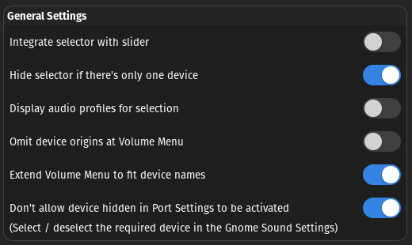

# My Pop-Os Setup :computer:

## Update system

> sudo apt update && sudo apt full-upgrade -y

## Verify driver NVIDIA

> nvidia-smi

### Install driver, wether isn't installed:

> Download driver

> chmod +x yourfilename. run

</br>


### Extensions to install

- ### Gnome-tweaks
```
sudo apt install gnome-tweaks
```
> Window Titlebars > Placement = left


- [**Sound Input & Output Device Chooser**](https://extensions.gnome.org/extension/906/sound-output-device-chooser)


Config default:




- [**Extension List**](https://extensions.gnome.org/extension/3088/extension-list/)

- [**Hide Top Bar**](https://extensions.gnome.org/extension/545/hide-top-bar/)


# Apps Default

## Google Chrome

```
wget https://dl.google.com/linux/direct/google-chrome-stable_current_amd64.deb &&
sudo apt install ./google-chrome-stable_current_amd64.deb
```
## Webcamoid
*https://webcamoid.github.io/*
```
sudo apt install webcamoid -y
```


## ZSH
https://github.com/ohmyzsh/ohmyzsh/wiki/Installing-ZSH
```
sudo apt install zsh -y
```
<br>

## Oh-My-Zsh
*https://ohmyz.sh/#install*
```
sh -c "$(curl -fsSL https://raw.githubusercontent.com/ohmyzsh/ohmyzsh/master/tools/install.sh)"

```

> **Logout to save this installation**

<br>

## Brew
```
/bin/bash -c "$(curl -fsSL https://raw.githubusercontent.com/Homebrew/install/HEAD/install.sh)"

---

echo 'eval "$(/home/linuxbrew/.linuxbrew/bin/brew shellenv)"' >> /home/$USER/.profile

eval "$(/home/linuxbrew/.linuxbrew/bin/brew shellenv)"
```
> **Logout to save this installation**

## Qbittorrent
*https://lindevs.com/install-qbittorrent-nox-on-ubuntu*

## Flameshot

*https://flameshot.org/docs/installation/installation-linux/* | tip to binding: *https://askubuntu.com/questions/1036473/how-to-change-screenshot-application-to-flameshot-on-ubuntu-18-04*

```
apt install flameshot
```
> Add to start on boot
> Settings > Keyboard > Keyboard Shortcuts > Custom Shortcut > print
<br>

## Htop
``` 
sudo apt install htop 
``` 
<br>

# Apps to Work/Study

## Visual Studio Code

*https://code.visualstudio.com/docs/setup/linux*
```
sudo apt-get install wget gpg

wget -qO- https://packages.microsoft.com/keys/microsoft.asc | gpg --dearmor > packages.microsoft.gpg

sudo install -D -o root -g root -m 644 packages.microsoft.gpg /etc/apt/keyrings/packages.microsoft.gpg

sudo sh -c 'echo "deb [arch=amd64,arm64,armhf signed-by=/etc/apt/keyrings/packages.microsoft.gpg] https://packages.microsoft.com/repos/code stable main" > /etc/apt/sources.list.d/vscode.list'

rm -f packages.microsoft.gpg
```

## Terraform
*https://developer.hashicorp.com/terraform/tutorials/aws-get-started/install-cli*

```
sudo apt-get update && sudo apt-get install -y gnupg software-properties-common

wget -O- https://apt.releases.hashicorp.com/gpg | \
    gpg --dearmor | \
    sudo tee /usr/share/keyrings/hashicorp-archive-keyring.gpg

echo "deb [signed-by=/usr/share/keyrings/hashicorp-archive-keyring.gpg] \
    https://apt.releases.hashicorp.com $(lsb_release -cs) main" | \
    sudo tee /etc/apt/sources.list.d/hashicorp.list

sudo apt update

sudo apt-get install terraform

terraform -help
```
## Tfvars
*https://github.com/tfutils/tfenv*

```
brew install tfenv
```
## Kubectl
https://kubernetes.io/docs/tasks/tools/install-kubectl-linux/#install-kubectl-binary-with-curl-on-linux

```
brew install kubectl
```
## Docker - NITRO5 (Required - *https://gist.github.com/kuang-da/2796a792ced96deaf466fdfb7651aa2e*)
https://docs.docker.com/engine/install/ubuntu/

```
sudo apt install docker.io
sudo apt install docker-compose

# docker without sudo

sudo groupadd docker
sudo usermod -aG docker $USER

## close terminal and reopen

newgrp docker
```
## AWS CLI
https://docs.aws.amazon.com/cli/latest/userguide/install-cliv2-linux.html#cliv2-linux-install

```
cd /tmp
curl "https://awscli.amazonaws.com/awscli-exe-linux-x86_64.zip" -o "awscliv2.zip"
unzip awscliv2.zip
sudo ./aws/install
```

## Keyboard Shortcuts

**In Settings > Keyboard > Keyboard Shortcuts**

Sound and Media
>
>- Volume down on **Super + -**
>
>- Volume up on **Super + =**
>
>- Volume mute/unmute on **Super + 0**

Navigation
>
> Hide All normal Windows on **Super + D** 

Custom Shortcuts
>- Flameshot on **PrintScreen**
>

